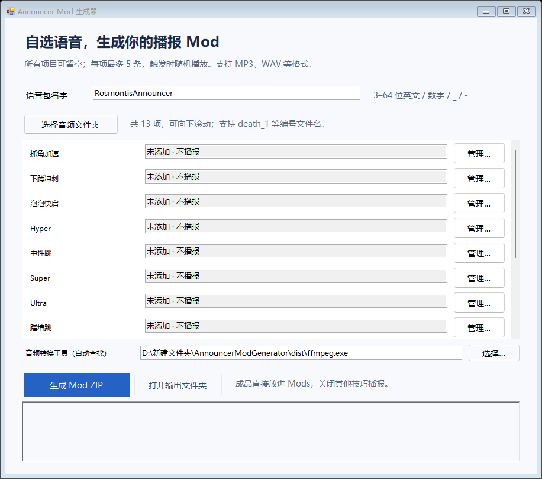

# Announcer Mod Generator

Windows 图形工具：自选音频，自动生成 Everest 版《蔚蓝》的独立播报 Mod。13 个项目全部可选，每项支持 0–5 条音频。

支持九种技巧，以及普通死亡、带金草莓死亡、吃掉草莓和吃掉金草莓。未添加音频的项目不播报；添加多条时，每次触发等概率随机播放其中一条，允许连续抽到同一条。



## 使用

1. 从本仓库的 Releases 下载 **v1.2.0 或更新版本**的工具 ZIP 并解压。
2. 自行取得有权使用的 `TechAnnouncer.zip`，放在程序旁边；从 [FFmpeg 官方下载页](https://ffmpeg.org/download.html) 选择 Windows 构建，将解压后的 `ffmpeg.exe` 放在程序旁边，也可以在界面中指定路径。
3. 双击 `AnnouncerMod生成器.exe`，点击所需项目旁的“管理…”，添加、移除或清空音频。列表可向下滚动查看死亡和草莓项目。填写语音包名字，点击“生成 Mod ZIP”。
4. 将生成的 ZIP 放入蔚蓝 `Mods` 文件夹。在 Mod 选项中开启你填写的名字对应的 **Enabled**；关闭 TechAnnouncer、NeuroAnnouncer 等其他技巧播报的 Enabled，避免重复播报。

**下载包不包含 TechAnnouncer 模板和 FFmpeg。** 保留程序旁边的 `Mono.Cecil.dll`，并自行准备上述依赖。此前包含依赖的 v1.1.1 已撤回。

名字以英文字母开头，长度 3–64 位，可使用英文、数字、下划线和短横线。同一项目内不能重复添加同一文件，不同项目可以共用音频。每条音频长 0.01–30 秒，不能是全静音。支持 MP3、WAV、OGG、FLAC、M4A、AAC、WMA、OPUS、AIFF。生成的 Mod 不需要 FFmpeg，也不依赖另装 TechAnnouncer。全部留空也可以生成静音模组，此时不需要 FFmpeg。

同名文件夹中可自动识别以下文件名，大小写不敏感，扩展名可以更换：

| 技巧事件 | 示例文件名 |
| --- | --- |
| cornerboost | CornerBoost.mp3 |
| demodash | Demodash.mp3 |
| fastbubble | fastbubble.mp3 |
| hyperdash | Hyperdash.mp3 |
| neutral | NeutralJump.mp3 |
| superdash | superdash.mp3 |
| ultradash | UltraDash.mp3 |
| wallbounce | WallBounce.mp3 |
| wavedash | wavedash.mp3 |
| death（普通死亡） | death_1.mp3 |
| goldendeath（带金草莓死亡） | goldendeath_1.mp3 |
| strawberry（吃掉草莓） | strawberry_1.mp3 |
| goldenstrawberry（吃掉金草莓） | goldenstrawberry_1.mp3 |

每项多条音频可命名为 `death_1.mp3` 至 `death_5.mp3`；也支持 `death1.mp3`、`death-1.mp3`、中文事件名称。文件夹匹配超过五条时会提示处理，不会静默丢弃。

带金草莓死亡仅触发 `goldendeath`，不会额外触发普通死亡；金草莓收集仅触发 `goldenstrawberry`。对应项目留空时保持静音，不回退到普通事件。收集指草莓被正式吃掉，不是刚碰到并开始跟随；同一草莓不会重复播报。无敌状态下未实际死亡也不会播报。支持原版 `Strawberry` 及其子类，另有自定义收集机制的模组草莓不保证适用。

## 本版本的判定修改

以用户提供的 TechAnnouncer 1.0.1 为模板。在实际冲刺事件中识别专用 Demo 键及手动水平蹲冲，处理原版 Demo Dash 漏播；同一次冲刺不会重复播报。Neutral Jump 保留原逻辑。语音长度根据输入调整，并处理 Ultra 模板的分段播放。

每个生成的 Mod 都有自己的程序集身份、配置和音频 GUID。素材没有 farewell 时，该额外事件保持静音。工具直接重建 FMOD 音频库，不生成可编辑的 `.fspro` 工程。

## 从源码编译

Windows 自带的 .NET Framework 编译器即可编译，不需要安装 Python、FMOD Studio 或 Visual Studio：

```powershell
powershell -ExecutionPolicy Bypass -File .\scripts\build.ps1
```

脚本从 NuGet 官方源下载固定版本的 Mono.Cecil，并检查包的 SHA-256，输出到 `dist`。默认仅编译生成器，不下载或内置模板及 FFmpeg。可为本地使用指定自行准备的模板：

```powershell
.\scripts\build.ps1 -TemplateZip 'D:\素材\TechAnnouncer.zip'
```

离线编译可通过 `-CecilPath` 指定已有的 Mono.Cecil 0.10.4 DLL。运行时辅助代码使用本项目编写的最小 API 声明编译，无需游戏文件；生成模组包含独立命名的运行时 DLL。`scripts/package.ps1` 将程序、Mono.Cecil、使用说明及许可打包为 v1.2.0 下载包；即使本地 `dist` 存在模板、FFmpeg 或用户音频，打包也不会包含它们。

## 命令行

```powershell
& '.\dist\AnnouncerMod生成器.exe' --name MyAnnouncer --input-dir 'D:\音频' --output 'D:\输出\MyAnnouncer.zip'
```

默认拒绝覆盖已有输出；主动加 `--overwrite` 才会覆盖。可用 `--ffmpeg 路径` 指定 FFmpeg。任意文件名可以通过 `--inputs 映射.json` 指定，相对路径以 JSON 所在目录为基准，示例见 [examples/inputs.json](examples/inputs.json)。

映射支持单个路径或最多五条的数组；省略、`null`、`[]` 和空字符串均表示不播报。旧版单路径映射仍可使用。例如：

```json
{
  "demodash": "audio/demo.mp3",
  "death": ["audio/death_a.mp3", "audio/death_b.mp3"],
  "goldendeath": [],
  "strawberry": "audio/berry.mp3"
}
```

## 验证

已对九条原始音频和九条约 4–7 秒长音频使用蔚蓝的 FMOD 1.10.20 引擎播放比对，检查播放完整性和多个音频包同时加载的独立性；完成 11 项生成后判定检查，以及错误输入、输出覆盖保护和界面检查。记录见 [验证报告](docs/validation-report.json)。

v1.2.0 另行验证全部 13 × 5 个音频位置在 FMOD 1.10.20 中同时加载后播放，测试可选输入、上限和错误输入，以及死亡/草莓 Hook 分类、重复触发保护和卸载。记录见 [新版验证报告](docs/optional-validation.json)。11 项 Demo Dash / Neutral 判定回归测试也保留。

这些验证没有进行游戏内实际操作，新事件和 Demo Dash 仍需在游戏中复测。

集成测试需要 Python、NumPy、本地蔚蓝游戏和自备模板。测试自行生成短测试音频，不会下载游戏资源。先将模板放到 `dist/TechAnnouncer.zip`，并指定自行安装的 FFmpeg：

```powershell
$env:CELESTE_DIR = 'D:\Steam\steamapps\common\Celeste'
$env:FFMPEG_PATH = 'D:\工具\ffmpeg.exe'
python .\tests\test_generator.py
```

测试生成的临时文件会自动清理，构建和测试产物由 Git 忽略。

下载包验证检查模板和 FFmpeg 未被打包，并用本地自备依赖及九条音频检查生成功能：

```powershell
$env:ANNOUNCER_TEMPLATE_ZIP = 'D:\素材\TechAnnouncer.zip'
$env:ANNOUNCER_AUDIO_DIR = 'D:\九条测试音频'
python .\tests\test_distribution.py
```

## 来源与许可

本仓库的生成器代码按 MIT 许可发布。TechAnnouncer 原有程序和声音不属于该 MIT 许可，本仓库及下载包不分发模板。请自行确认所用模板及音频的使用、修改和再分发授权；生成工具不授予这些素材的权利。FFmpeg 由用户自行安装，以独立进程执行，本仓库及下载包不分发其二进制。

- [制作教程](https://www.bilibili.com/opus/1033106442681319432)
- 技巧检测与模板：Brokemia 的 TechAnnouncer 1.0.1。
- 程序集编辑：[Mono.Cecil](https://github.com/jbevain/cecil)，MIT 许可。完整声明见 [THIRD-PARTY-NOTICES.txt](THIRD-PARTY-NOTICES.txt)。
- [FFmpeg 官方下载来源](https://ffmpeg.org/download.html)。Windows 二进制构建由该页面列出的第三方提供，适用许可请以所选构建说明为准。

